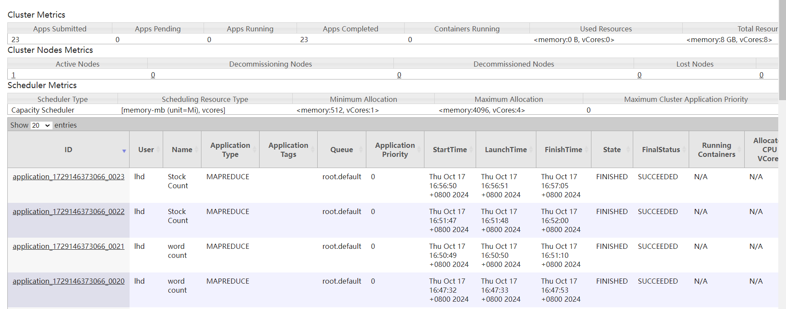
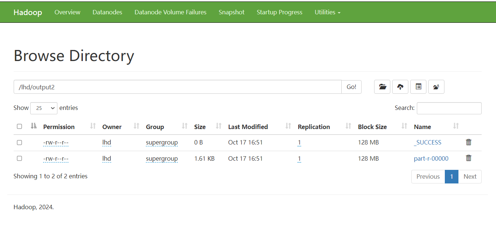

# Hadoop MapReduce 项目

## 项目简介

本项目包含两个 Hadoop MapReduce 程序：`WordCount` 和 `StockCount`。`WordCount` 用于统计文本文件中单词的出现次数，并输出前 100 个高频单词；`StockCount` 用于统计股票代码的出现次数，并按出现次数从大到小输出。


## 设计思路

### WordCount

`WordCount` 程序的设计思路如下：

1. **Mapper**：`TokenizerMapper` 类读取输入文件的每一行，提取单词并输出键值对 `(单词, 1)`。在 `setup` 方法中加载停词列表，过滤掉停词。
2. **Reducer**：`IntSumReducer` 类汇总每个单词的出现次数，并存储在一个 `Map` 中。在 `cleanup` 方法中使用优先队列对结果进行排序，并输出前 100 个高频单词。

### StockCount

`StockCount` 程序的设计思路如下：

1. **Mapper**：`StockMapper` 类读取输入文件的每一行，提取股票代码并输出键值对 `(股票代码, 1)`。
2. **Reducer**：`StockReducer` 类汇总每个股票代码的出现次数，并存储在一个 `Map` 中。在 `cleanup` 方法中使用优先队列对结果进行排序，并按出现次数从大到小输出。

## 运行步骤

1. **编译项目**：
   ```sh
   mvn clean package


2. **上传输入文件到 HDFS**：
   
   ```sh
   hdfs dfs -put /path/to/local/input.txt /path/to/hdfs/input/
   ```
   
3. **运行 WordCount 作业**：
   
   ```sh
   hadoop jar target/my-hadoop-jobs-2.0.jar com.example.WordCount /path/to/hdfs/input/ /path/to/hdfs/output/
   ```
   
4. **运行 StockCount 作业**：
   ```sh
   hadoop jar target/my-hadoop-jobs-2.0.jar com.example.StockCount /path/to/hdfs/input/ /path/to/hdfs/output2/
   ```

5. **查看输出结果**：
   
   ```sh
   hdfs dfs -cat /path/to/hdfs/output/part-r-00000
   hdfs dfs -cat /path/to/hdfs/output2/part-r-00000
   ```
## Web页面截图
1. 运行状态截图：


2. 文件系统截图，可以看到生成的文件：



## 程序运行结果

### WordCount

`WordCount` 程序的输出结果是前 100 个高频单词及其出现次数。例如：

```
1 : s   75954
2 : 0   64533
3 : stocks      54702
4 : market      39550
5 : eps 37995
6 : vs  36784
7 : shares      36291
8 : reports     33653
9 : update      31535
10 : est        30380
11 : earnings   27821
```

### StockCount

`StockCount` 程序的输出结果是股票代码及其出现次数，按出现次数从大到小排序。例如：

```
1:MS    1174
2:MRK   1141
3:MU    1096
4:NVDA  1091
5:VZ    1080
6:NFLX  1078
7:QCOM  1051
8:BABA  1044
9:GILD  1041
10:EBAY 1037
```

## 依赖

项目依赖于以下库：

- Hadoop Common 3.4.0
- Hadoop MapReduce Client Core 3.4.0

请确保在运行项目之前已正确配置 Hadoop 环境。